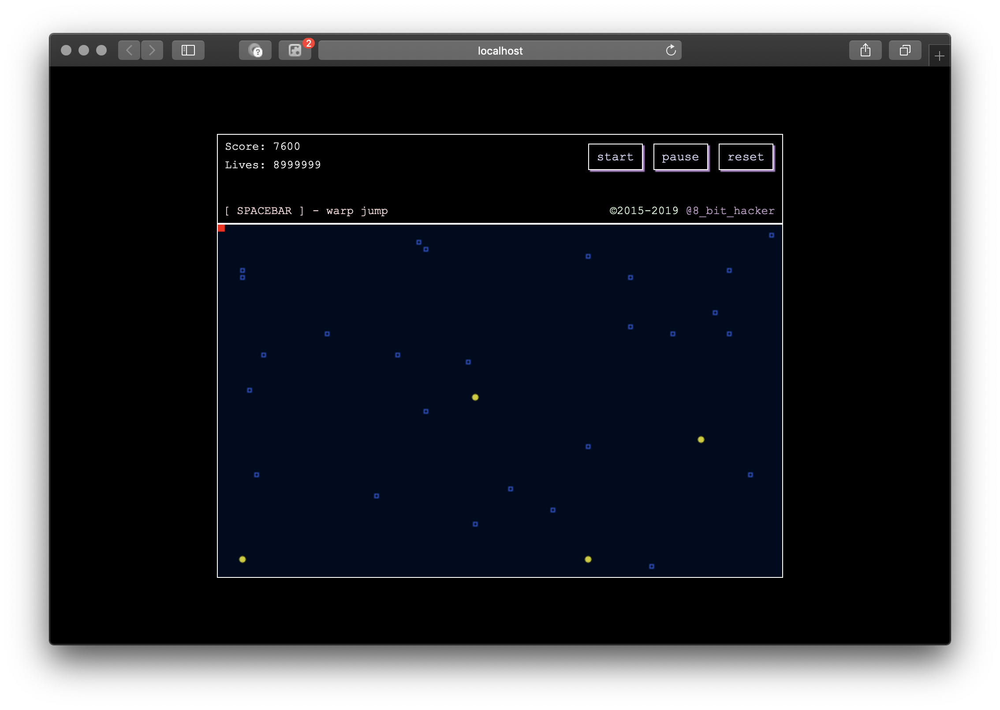

# bytes
Retro snake game built with HTML5 Canvas and TypeScript

### Introduction
This is a simple 2D game built from scratch with TypeScript 3.4 and HTML5 Canvas.

### Getting Started
To run this project:
1. Clone it to your local machine
2. Ensure you have TypeScript 3.4 - to install it, type `npm install -g typescript`
3. `cd` into the project directory (i.e. `cd bytes` or wherever you cloned the repo to)
4. Run `tsc` to compile the application
5. Serve the app with a static server such as [serve](https://www.npmjs.com/package/serve)

### Contributing
Bug reports, pull requests, and other contributions are welcome. As this was a simple example game that I developed
with my kids to teach the concepts of simple game development and not a professional product, there may be errors or things
missing which would otherwise be present. 

Any questions, comments, or suggestions are also welcome (but please be courteous and professional).
Thanks!
-K
